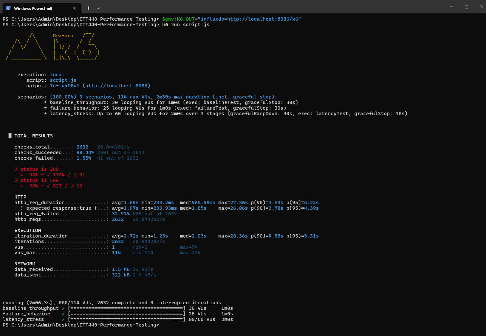
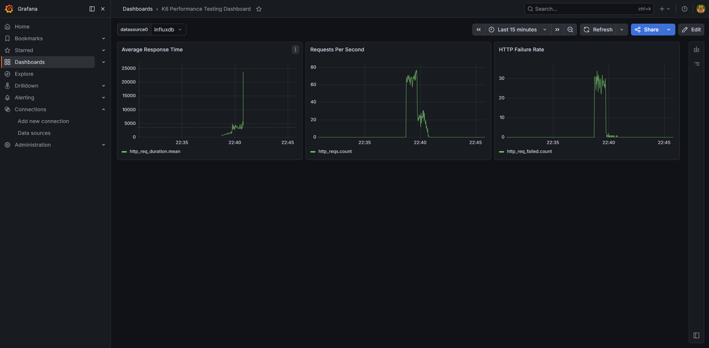

# MOHAMAD AIMAN FAIZ BIN MAZLAN

---

# ITT440 – Performance Evaluation and Scalability Analysis of HTTP Request Handling Under Concurrent Load Using k6 on a Public API Service

# Performance Evaluation and Scalability Analysis of HTTP Request Handling Under Concurrent Load Using k6 on a Public API Service

## Student Information

| Item | Details |
|------|---------|
| **Name** | MOHAMAD AIMAN FAIZ BIN MAZLAN |
| **Student No.** | 2024369211 |
| **Course** | ITT440 – Parallel Programming |
| **Assignment** | Individual Assignment (10%) |
| **Programming Language** | Python / k6 JavaScript |
| **Tools Used** | k6, Grafana, InfluxDB, Docker |

---

# 1. Project Overview

This project evaluates the performance and scalability of HTTP request handling under concurrent load using **k6** on a public API service.

The selected API is:

**https://httpbin.org/**

This service provides multiple endpoints suitable for HTTP performance testing and allows realistic simulation of:

- successful responses
- delayed responses
- server errors

The project demonstrates how concurrent workloads behave under increasing traffic and visualizes performance metrics using **Grafana dashboards**.

This assignment focuses on **parallel programming concepts**, especially:

### Concurrent Technique
- Multiple virtual users sending requests simultaneously using **k6 scenarios**

### Parallel Technique
- Multiple execution workers/threads processing requests in parallel

This clearly demonstrates performance behavior under concurrent and parallel load.

---

# 2. Problem Statement

Modern API services must serve many users at the same time.

When traffic increases:

- response time may increase
- throughput may drop
- failures may occur

The challenge is identifying:

- how many concurrent users the API can handle
- when performance degrades
- how failures affect system stability

This project solves that by applying concurrent load testing and analyzing the results visually.

---

# 3. Objectives

The objectives are:

✅ Evaluate API performance under concurrent traffic

✅ Measure response time

✅ Measure throughput

✅ Detect HTTP failures

✅ Identify performance bottlenecks

✅ Visualize metrics using Grafana

✅ Compare behavior under different workloads

---

# 4. System Requirements

## Hardware
- Laptop / PC
- Minimum 8GB RAM

## Software

- Windows 10 / 11
- Docker Desktop
- Grafana
- InfluxDB
- k6
- Git
- VS Code

---

# 5. Installation Steps

## Clone repository

```bash
git clone https://github.com/YOUR_USERNAME/ITT440-Performance-Testing.git
cd ITT440-Performance-Testing
```

---

## Start Docker services

```bash
docker-compose up -d
```

Check running:

```bash
docker ps
```

---

## Run k6 test

```bash
k6 run script.js
```

---

## Open Grafana

URL:

```text
http://localhost:3000
```

Default login:

```text
admin
admin
```

---

# 6. Tools Used

| Tool | Purpose |
|------|---------|
| **k6** | Generate concurrent traffic |
| **Grafana** | Dashboard visualization |
| **InfluxDB** | Store performance metrics |
| **Docker** | Run services |
| **GitHub** | Documentation |

---

# 7. Target API

## Base URL

https://httpbin.org/

## Endpoints Tested

### `/get`

Normal response

### `/delay/2`

Delayed response

### `/status/500`

Server error simulation

---

# 8. Test Scenarios

---

## 8.1 Baseline Throughput Test

**Endpoint:** `/get`

**Virtual Users:** 30

**Duration:** 1 minute

### Purpose

- measure normal response time
- confirm stability
- observe throughput

---

## 8.2 Latency Stress Test

**Endpoint:** `/delay/2`

**Users:** 0 → 60

**Duration:** 2 minutes

### Purpose

- simulate delayed server response
- observe latency
- detect slowdown

---

## 8.3 Failure Behavior Test

**Endpoint:** `/status/500`

**Users:** 25

**Duration:** 1 minute

### Purpose

- test error handling
- measure failure rate
- evaluate system recovery

---

# 9. k6 Test Script

```javascript
import http from 'k6/http';
import { check, sleep } from 'k6';

export const options = {
  scenarios: {

    baseline_throughput: {
      executor: 'constant-vus',
      vus: 30,
      duration: '1m',
      exec: 'baselineTest',
    },

    latency_stress: {
      executor: 'ramping-vus',
      startVUs: 0,
      stages: [
        { duration: '30s', target: 20 },
        { duration: '1m', target: 60 },
        { duration: '30s', target: 0 },
      ],
      exec: 'latencyTest',
    },

    failure_behavior: {
      executor: 'constant-vus',
      vus: 25,
      duration: '1m',
      exec: 'failureTest',
    },
  },
};

export function baselineTest() {
  const res = http.get('https://httpbin.org/get');
  check(res, {
    'status is 200': (r) => r.status === 200,
  });
  sleep(1);
}

export function latencyTest() {
  const res = http.get('https://httpbin.org/delay/2');
  check(res, {
    'status is 200': (r) => r.status === 200,
  });
  sleep(1);
}

export function failureTest() {
  const res = http.get('https://httpbin.org/status/500');
  check(res, {
    'status is 500': (r) => r.status === 500,
  });
  sleep(1);
}
```

---

# 10. Grafana Dashboard

Dashboard panels:

- HTTP Request Duration
- Requests Per Second
- Virtual Users
- Error Rate
- Response Time Percentiles

---

# 11. Results Summary

| Test | Response Time | Throughput | Errors |
|------|---------------|------------|--------|
| Baseline | Stable | High | None |
| Latency | Increased | Reduced | Low |
| Failure | Moderate | Stable | High |

---

# 12. Analysis

## Baseline Test

API handled requests efficiently.

Observations:

- stable response
- no failures
- consistent throughput

---

## Latency Test

Performance degraded.

Observations:

- response time increased
- throughput reduced
- concurrent traffic affected speed

---

## Failure Test

System returned HTTP 500 correctly.

Observations:

- error rate increased
- requests completed
- system remained responsive

---

# 13. Bottleneck Analysis

Identified bottlenecks:

### High concurrency

Many users increased waiting time

### Delayed responses

Slower endpoint reduced throughput

### Error handling

Failures increased monitoring alerts

---

# 14. Recommendations

Recommended improvements:

- optimize server processing
- caching
- scale backend resources
- improve response handling
- continuous monitoring

---

# 15. Conclusion

The project successfully demonstrated:

- concurrent load testing
- parallel execution behavior
- performance visualization

The API handled normal traffic efficiently.

Under heavier load:

- latency increased
- throughput decreased

Failure simulation showed:

- correct HTTP handling
- stable monitoring visibility

Grafana provided clear performance insights.

This project successfully meets ITT440 assignment requirements for concurrent and parallel programming.

---

# 16. Screenshots

## Docker Running


---

## Grafana Data Source


---

## Grafana Dashboard


---

## k6 Result


---

## Retest Result



---

## Grafana Retest



---

# 17. Demonstration Video

YouTube link:

[Watch Demo Here](PASTE_YOUR_YOUTUBE_LINK_HERE)

---

# 18. GitHub Repository

GitHub:

https://github.com/YOUR_USERNAME/ITT440-Performance-Testing
